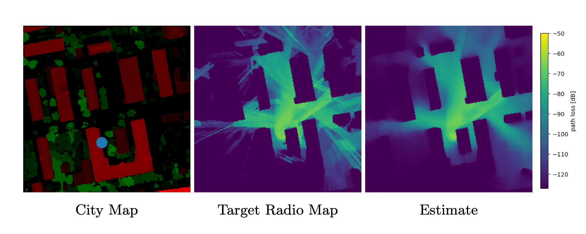

# Update

For an updated version of this repo with a focus on estimation of radio maps from images, see [https://github.com/fabja19/RML_v2_img](https://github.com/fabja19/RML_v2_img).

# Radio Map Estimation - An Open Dataset with Directive Transmitter Antennas and Initial Experiments

This is the official implementation of our experiments on learning radio map estimation with CNNs, described in ["Radio Map Estimation - An Open Dataset with Directive Transmitter Antennas and Initial Experiments"](https://arxiv.org/abs/2402.00878). We build upon previous works on this topic such as RadioUNet or PMNet, and develop the approach further with a more realistic dataset based on 3D city models of real world locations. These feature detailed roof and tree canopy heights and shapes, obtained from public LiDAR data. The radio map simulations have been conducted with directive antennas on the Tx side. We compare different architectures and input modalities on this new dataset.

If you find this useful and use our code, please cite our paper:

> Fabian Jaensch, Giuseppe Caire and Begüm Demir, "[Radio Map Estimation -- An Open Dataset with Directive Transmitter Antennas and Initial Experiments]([https://arxiv.org/abs/2501.11493](https://arxiv.org/abs/2402.00878))", arXiv:2402.00878, 2024.
```bibtex
@misc{jaensch2024radiomapestimation,
      title={Radio Map Estimation -- An Open Dataset with Directive Transmitter Antennas and Initial Experiments}, 
      author={Fabian Jaensch and Giuseppe Caire and Begüm Demir},
      year={2024},
      eprint={2402.00878},
      archivePrefix={arXiv},
      primaryClass={cs.NI},
      url={https://arxiv.org/abs/2402.00878}, 
}
```




## Requirements

The dataset can be downloaded from [zenodo](https://zenodo.org/uploads/10210089) and is expected to be unpacked to the directory *./dataset*.

To install the required packages via conda run:

```
conda env create -f conda_env/env_complete.yml
```

The environment has been used on Linux computers with CUDA 11.8 and A100 GPUs. On different OS/hardware, you may need to use the less restrictive file [conda_env/env_short.yml](conda_env/env_short.yml) or adjust some packages.

## Basic Usage

To replicate the experiments from the paper, run this command:

```
python main_cli.py fit --model=<model name> --config=<path to config>
```

Here, ```<model name>``` can be any of  _LitRadioUNet, LitPMNet_ or _LitUNetDCN_ and the configs for the dataset class corresponding to our experiments can be found in  the directory [configs/data](configs/data). The training procedure will save the results including a model checkpoint, log file, config and Tensorboard log in a subdirectory of [./logs](./logs).

Instead of training from scratch, you can [download](https://zenodo.org/uploads/10210089) the checkpoints and configs for some of the trained models.

Trained models can be evaluated on the test set by running

```
python main_cli.py test --config=<path to config> --ckpt_path=<path to checkpoint> --trainer.logger.sub_dir=test
```

and inference on the test set is possible with:

```
python main_cli.py predict --config=<path to config> --ckpt_path=<path to checkpoint> --trainer.logger.sub_dir=predict
```

## More options

Arguments for the dataset class (inputs for the model) and hyperparameters of the models and the training procedure can be set with flags. To get an overview of all possible commands, run:

```
python main_cli.py fit --help
python main_cli.py fit --model.help <model class>
python main_cli.py fit --data.help LitRM_directional
```

More information can be found in the documentation of [PyTorch Lightning](https://lightning.ai/docs/pytorch/stable/) and in particular the [CLI](https://lightning.ai/docs/pytorch/stable/cli/lightning_cli.html#lightning-cli).

